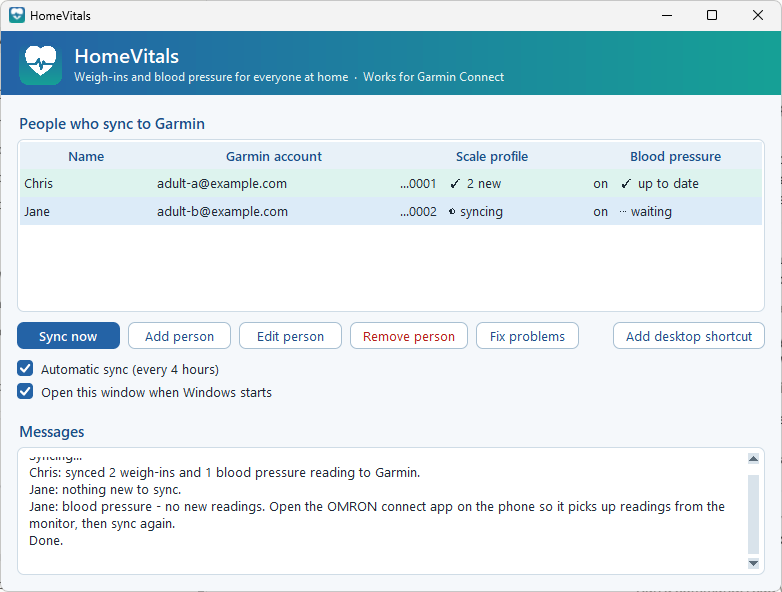
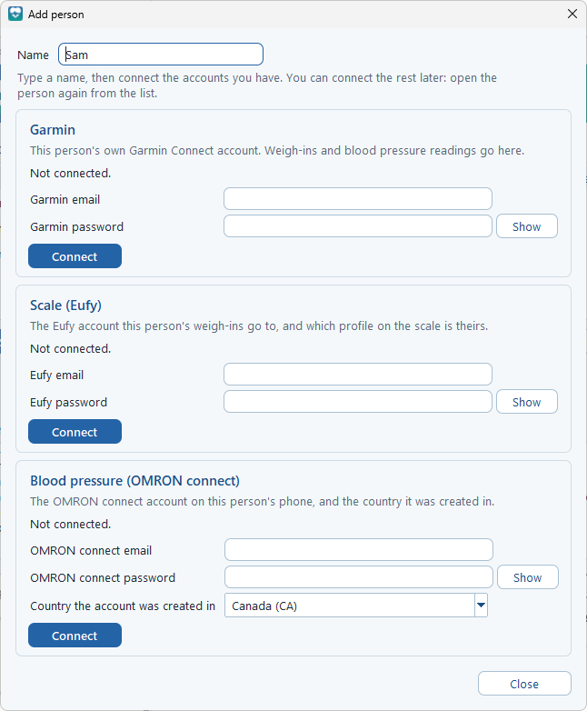

# HomeVitals

**Works for Garmin Connect.** Sync a household's smart scale and blood pressure readings to *each person's own* Garmin Connect account.

[](https://github.com/smithbuilt/homevitals/actions/workflows/test.yml)
[](https://pypi.org/project/homevitals/)




Garmin's own scales and monitors sync by themselves. Many homes use a **Eufy smart scale** and an **OMRON blood pressure monitor** instead, shared by everyone in the house. HomeVitals moves each person's readings into their own Garmin Connect account:

- **Weigh-ins** from the Eufy scale (EufyLife cloud): weight and full body composition.
- **Blood pressure readings** from the OMRON monitor, through the OMRON connect app: systolic, diastolic and pulse, with "irregular heartbeat detected" or "body movement detected" in the reading's note when the monitor flagged it.

Each person keeps their own accounts. Weigh-ins only go to the person whose scale profile they are, and scale profiles not linked to anyone (the kids', a guest's) are never sent anywhere.

> HomeVitals is not affiliated with, endorsed by or supported by Garmin, Eufy/Anker or OMRON. It uses the same connections their apps use, which aren't public APIs and can change without notice. It is not a medical device: always check readings on the monitor or in the manufacturer's app.

## What's been tested

| | |
|---|---|
| Windows 11 | Tested daily: window, tray icon, automatic sync, shortcuts |
| macOS, Linux | Not tested. The command line came from [eufy-sync](https://github.com/sturimcode/eufy-sync), which supports them; the window's tray icon and taskbar parts are Windows-only |
| Scales | A Eufy Wi-Fi smart scale through the EufyLife app's cloud |
| Blood pressure | OMRON M7 Intelli IT (HEM-7361T) with the OMRON connect app (EU server). Other monitors that sync to OMRON connect should work; tell us if yours does |
| People | Two adults, each with their own Garmin and OMRON connect accounts, sharing one Eufy scale that also has unlinked kids' profiles |

## Install

You need Python 3.12+ and [uv](https://docs.astral.sh/uv/) (or pipx).

```
uv tool install homevitals
homevitals-gui
```

The window opens. Click **Add desktop shortcut** to open it from the desktop from then on.

Update later with `uv tool upgrade homevitals`. HomeVitals never updates itself.

## Setting up your household



Click **Add person**, type a name, and connect what that person uses. Each box connects on its own, checked with a real login before anything is saved, so you can add Garmin today and the scale next week. Nothing is required except a name.

- **Garmin:** the person's own Garmin Connect account. Garmin may email a security code; a box asks for it.
- **Scale (Eufy):** the Eufy account the person's weigh-ins go to, then pick their profile on the scale (shown by last weight and date). Profiles already linked to someone are greyed out. By default each person uses their own Eufy account, so nobody sees anyone else's weight; if two people really share one Eufy login, each types it in their own box.
- **Blood pressure (OMRON connect):** the person's OMRON connect email and password, and **the country the OMRON connect account was created in**. See the OMRON note below.

Then click **Sync now**, and tick **Automatic sync (every 4 hours)**. While a sync runs, each person's row shows ⋯ waiting, a turning *syncing* symbol, then ✓ 2 new, ✓ up to date or ✗ failed.

**Fix problems** checks every login and setting and shows a button to fix what it can. Closing the window keeps HomeVitals running by the clock; right-click its icon there for **Quit**.

## Things worth knowing

**The phone apps have to see the readings first.** The scale's weigh-ins reach Eufy's cloud only after the Eufy app has picked them up, and the monitor's readings reach OMRON's cloud only after the OMRON connect app has pulled them off the monitor. If a sync says "nothing new", open the right app on the phone, wait a moment and sync again.

**OMRON's country matters as much as the password.** Each country uses its own OMRON server, so the country in HomeVitals must be the one chosen when the OMRON connect account was created. A wrong country fails exactly like a wrong password, and the window says so. Some regions in the OMRON connect app keep readings on the phone only, with no cloud at all (Qatar is one); readings from such an account can't be synced, so create the account in a country with cloud sync.

**Older readings.** The first sync brings in the last 7 days of weigh-ins and 30 days of blood pressure. To bring in more blood pressure history (up to 10 years, or what the monitor and app hold), open the person and click **Bring in older readings**. Nothing is ever uploaded twice: HomeVitals remembers what it sent and checks what Garmin already has.

**Numbers are never changed.** Readings go to Garmin exactly as measured. One that Garmin won't accept is skipped and reported, never rounded.

## Privacy and security

- Everything runs on your own computer. HomeVitals talks only to Eufy, OMRON and Garmin, with the accounts you give it.
- Passwords are kept in the system's own password store (Windows Credential Manager). They never go into the settings file, the log or the window.
- Weights and blood pressure numbers never appear in the log file, the window's messages or notifications; only counts do.
- Settings and sync history live in `~/.homevitals` (on Windows `C:\Users\<you>\.homevitals`). The log file `sync.log` there is safe to share when asking for help.

## Advanced settings

Most people never need these. They go in a person's `omron:` part of `~/.homevitals/config.yaml` (quit the window first):

- `user_number`: send only that user's readings from the monitor. Leave it out and every reading in the person's OMRON connect account syncs, which is right when each person has their own account. Set it (1 to 99, the user number the monitor shows) when one account holds several people's readings.
- `server`: pin the OMRON server (`eu`, `na`, or a full `https://` address) if a correct login keeps failing.

```yaml
users:
  - name: Sam
    omron:
      email: sam@example.com
      country: GB
      user_number: 2
```

The command line is still there for scripts and servers: `homevitals --help`, `homevitals --doctor`.

## Coming from eufy-sync or an earlier HomeVitals name

HomeVitals started as a fork of [eufy-sync](https://github.com/sturimcode/eufy-sync), which syncs one person's Eufy scale. If you used eufy-sync (settings in `~/.garmin-sync`), the first start copies your settings, sync history and saved passwords over; the originals are left as they were.

## Credits and licence

MIT licence. Based on [eufy-sync](https://github.com/sturimcode/eufy-sync) by Elias Sturim (MIT): the Eufy and Garmin parts, the command line and the automatic sync come from there.

The OMRON connect part was written from scratch, using two open-source projects as references for how OMRON's servers behave: [omramin](https://github.com/bugficks/omramin) by bugficks and [omron-connect-mcp](https://github.com/aircon-chen/omron-connect-mcp) by aircon-chen (both GPL-2.0). No code from either is included.

Garmin and Garmin Connect are trademarks of Garmin Ltd. or its subsidiaries; Eufy is a trademark of Anker Innovations; OMRON and OMRON connect are trademarks of OMRON Corporation. They're named here only to say what HomeVitals works with.
